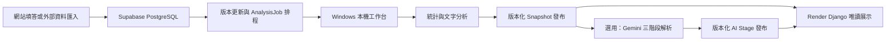

# Feedback Insight Hub

Feedback Insight Hub 是一套將問卷與外部回饋資料轉換為可追溯營運洞察的系統。網站負責問卷、權限、資料收集與結果展示；Windows 本機工作台負責統計、文字分析及經管理者啟用的 Gemini 解析。

系統的原則是：**資料與歷史結果保存在 Supabase PostgreSQL，重運算留在本機，Render 網站只讀已發布結果。**

## 目前功能

- 登入制問卷建立、題目設定、逐題填答與回覆管理。
- 管理者工作區：營運總覽、營運分析、問卷管理、統計分析、文字洞察、改善追蹤與通知中心。
- 通用外部資料匯入 mapping；外部資料會建立標準的 `Survey`、`Question`、`FeedbackSubmission` 與 `Answer`，和網站填答使用同一條後續分析流程。
- 依題目資料型態產生描述統計、分布與適用的推論分析；序位評分以 ordinal 處理，不會誤用平均數比較。
- 字典式文字分析：關鍵字、分類、情緒與涵蓋率均標示為分析結果，而非原始標籤。
- 本機工作台可查看各問卷的資料筆數、最新資料時間、統計／文字版本、Gemini 版本與待更新狀態；可手動更新或依設定於開啟時處理。
- 統計／文字結果與 AI 結果分段發布。Gemini 失敗不會覆蓋已成功發布的統計／文字結果。
- 改善建議先是可編輯草稿；建立改善項目、通知與寄信均需明確操作，不會自動執行。

## 資料與分析流程



1. 網站回覆或已核准的外部匯入資料寫入標準問卷結構。
2. 資料、題目、詞典或分析設定變動時，系統更新版本並合併待處理工作。
3. 本機工作台從 Supabase 讀取工作與問卷狀態，先執行統計與文字分析。
4. 第一階段通過版本核對後，會建立或重用不可變 Snapshot，並發布有限大小的展示 payload。
5. 管理者在本機明確啟用 API 額度後，第二階段才會呼叫 Gemini，依序產生統計解讀、文字洞察與綜合營運解析。
6. 新結果以版本保存；僅在輸入、管線版本與工作租約仍一致時更新發布指標。Render 只讀該指標，不在網頁請求中重算或呼叫 Gemini。

## 元件分工

| 元件 | 責任 |
| --- | --- |
| Django | 網頁、登入與角色權限、問卷、匯入、ORM、版本更新、工作排程、改善追蹤與發布結果讀取 |
| Supabase PostgreSQL | 問卷、回覆、匯入批次、工作狀態、Snapshot、AI Stage 與歷史發布結果的權威儲存 |
| Windows 本機工作台 | 問卷掃描、統計、文字分析、選用 Gemini、工作取消與版本化發布 |
| Pandas / SciPy | 描述統計與符合資料型態的推論分析 |
| Gemini | 根據受限、遮蔽且可驗證的分析證據產生解讀與改善草稿；不是統計計算器或最終決策者 |
| Render | Django 網站與靜態資源；分析頁只展示已發布結果 |

## 版本、併發與發布

- `SurveyAnalysisState` 保存每份問卷的輸入／設定版本與目前發布指標。
- `AnalysisJob` 將「統計與文字」及「AI synthesis」分為獨立工作，支援合併、取消、有限重試、租約與心跳。
- 工作完成時會再次核對版本與租約，防止過期 Worker 覆蓋較新的結果。
- Snapshot 與 AI Stage 以 revision 保存。歷史結果不會因發布新結果而被覆寫，可供後續比較。
- SQLite 適合一般純計算測試；原子領取、租約接手與過期 Worker 發布行為須在隔離 PostgreSQL 驗證。

## 資料保護與使用界線

- 不將 API key、資料庫密碼或 `.env` 提交 Git、寫入 log 或打包至 EXE。
- 外部資料的原始 `user_id` 僅在受控去重流程中使用；不得出現在清理產物、UI 或 log。
- 正式評論不可由 AI 或人工生成、翻譯、改寫或補造。測試 fixture 不得混入正式分析。
- 傳給 Gemini 的文字證據需經遮蔽，並限制筆數、單筆長度與總長度。AI evidence 與公開輸出也需避免個資。
- Gemini 的情緒、關鍵字、洞察與改善建議均屬分析結果，須由管理者審閱；相關性與群組差異不代表因果關係。

## 本機開發

以下以 Windows PowerShell 為例。請在隔離的開發資料庫操作；`migrate` 會修改所選資料庫 schema。

```powershell
python -m venv .venv
.\.venv\Scripts\Activate.ps1
python -m pip install -r requirements.txt
Copy-Item .env.example .env
python manage.py migrate
python manage.py runserver
```

必要環境變數依部署角色設定：

```env
DJANGO_SECRET_KEY=
DATABASE_URL=
DEBUG=True
ALLOWED_HOSTS=127.0.0.1,localhost

# 僅本機 Gemini 工作台需要
GOOGLE_API_KEY=
GEMINI_MODEL=gemini-2.5-flash
```

- 未設定 `DATABASE_URL` 時，開發環境可使用 SQLite；需要與網站共用資料時，設定受控的 PostgreSQL／Supabase 連線。
- `GOOGLE_API_KEY` 只應存在於執行 Gemini 的本機環境。Render 不應設定這個值。
- 請以既有管理流程建立 Manager 帳號；範例或 seed 資料不是標準啟動步驟。

## Windows 本機工作台與 EXE

先安裝桌面依賴後啟動：

```powershell
.\.venv\Scripts\python.exe -m pip install -r requirements-desktop.txt
.\.venv\Scripts\python.exe -m desktop_app
```

工作台提供「開啟時檢查」、「開啟後自動更新」與「第一階段完成後執行 Gemini」選項。最後一項預設關閉，勾選後才會使用本機 API 額度。

封裝入口為：

```powershell
.\scripts\build_desktop.ps1
# 需要保留主控台診斷資訊時
.\scripts\build_desktop.ps1 -Diagnostic
```

封裝不包含 `.env`、憑證、完整 Parquet 或其他大型資料產物。正式安裝包、簽章與長駐 Worker 服務仍待完成。

## Render 部署

`render.yaml` 定義單一 Django web service；`build.sh` 安裝依賴、收集靜態檔並套用 migration。部署前請確認目標資料庫、備份與回復方式，因 migration 會改變 schema。

Render 使用 `ANALYSIS_READ_PUBLISHED_ONLY=true`：

- 問卷、權限、設定與工作排程維持必要讀寫。
- 營運分析、統計、文字與 AI 展示僅讀已發布 payload。
- 網頁不掃描全量回覆、不訓練模型，也不呼叫 Gemini。

## 專案結構

```text
accounts/                         帳號、角色、個人資料與通知偏好
config/                           Django 設定、根路由、WSGI／ASGI
desktop_app/                      Windows 本機分析工作台與 EXE 入口
feedback/                         問卷、匯入、分析、工作協調、Snapshot 與改善追蹤
  analysis_input.py               共用分析輸入契約
  analysis_adapters.py            Answer／Parquet 輸入轉接
  analysis_jobs.py                版本失效、排程、租約與發布協調
  analysis_worker.py              統計／文字 Worker
  ai_worker.py                    明確授權的 Gemini Worker
  published_analysis.py           網頁唯讀發布結果
  importing/                      通用外部資料匯入
  import_mappings/                資料集欄位 mapping
docs/                             架構、資料匯入與交接文件
static/ templates/                Django 前端資產與樣板
```

## 目前限制

- 已具備本機 GUI 與 one-folder EXE 流程，但正式安裝、簽章、長駐服務與完整雲端端到端驗收尚未完成。
- 真實 Gemini 呼叫仍受 API 額度、網路、模型延遲與供應商行為影響；不確定狀態不會盲目重呼。
- 多組織／owner 層級的資料隔離、改善項目完整狀態歷程，以及通知寄送前預覽仍待擴充。
- 預測模型訓練、固定資料切分與 EXE 的模型管理介面尚未實作。

## 相關文件

- [系統架構](docs/architecture.md)
- [外部資料匯入與本機資料層](docs/external-dataset-import.md)
- [後續工作與驗證證據](docs/next-actions.md)
- [歷史變更](docs/CHANGELOG.md)

## 開發原則

- 先以實際程式、migration 與測試證據判斷功能狀態，不把歷史規劃當成已完成。
- 只執行與修改範圍相關的測試；測試前確認為隔離資料庫。
- 外部正式資料、模型產物與機密檔案不提交 Git。
- 發布、付費 AI、寄信與建立改善項目須依執行環境與權限設定處理。
