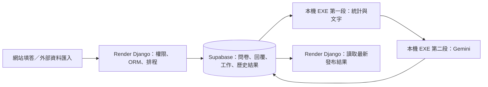

# 回饋洞察 AI 平台

**Feedback Insight Hub AI**

將問卷統計、文字洞察與 Gemini 分析整合成可追溯的營運建議與改善追蹤流程。

> An AI-assisted customer feedback operations platform that transforms survey statistics and text insights into evidence-grounded findings and actionable improvement drafts.

**核心特色**

- 登入制問卷管理、逐題填答與顧客回饋紀錄
- Pandas／SciPy 統計分析與字典式中文文字洞察
- `statistics -> text -> synthesis` 三階段 Gemini 分析
- 以可驗證 evidence refs 產生營運摘要與改善草稿
- PostgreSQL／Supabase 快取、input hash 與資料 freshness 判斷
- AI 草稿須由管理者確認後匯入，不會自行建立通知或寄信

**技術標籤**

`Python` `Django 6.0.8` `PostgreSQL / Supabase` `Google Gemini` `google-genai` `Pandas` `SciPy` `jieba` `HTML / CSS`

## 專案動機

一般問卷平台能完成資料收集，但管理者仍需自行閱讀圖表、統計檢定與大量文字回饋，再手動整理成改善方案。本專案將問卷建立、回覆收集、統計分析、文字洞察、AI 營運報告、改善追蹤與通知串成同一套管理流程。

系統先由後端計算統計量與文字聚合結果，再建立不含姓名、Email、user ID 或原始回答內容的聚合快照。Gemini 的角色是解讀這些已整理且可驗證的證據，產生營運發現與改善草稿；統計計算與最終決策仍由後端流程及管理者負責。

## 功能亮點

### 1. 問卷與回饋管理

- Manager 可建立問卷、分類、題目、資料型態與關鍵字追蹤設定。
- 顧客登入後以逐題流程填答，系統保存提交紀錄與後續通知同意狀態。
- 提供問卷 QR Code、啟用狀態、回覆趨勢與 Survey Builder。
- 顧客入口可查看填答紀錄、通知、個人資料與通知偏好。
- 問卷目前採 login-only 模式，不提供匿名公開填答入口。

### 2. 統計與文字分析

- 後端使用 Pandas／SciPy 建立描述統計、分布與推論分析。
- 已實作 Welch t-test、ANOVA、卡方檢定、Mann-Whitney U、Kruskal-Wallis、Pearson 與 Spearman 相關。
- 不適合的變數組合會回傳跳過原因，不強行產生統計結論。
- 文字流程整合 jieba、停用詞、同義詞、情緒字典與資料庫關鍵字分類規則。
- 文字洞察頁顯示關鍵字頻率、文字涵蓋率及分類情緒分布，並可維護關鍵字規則。

### 3. AI 營運分析

- 每次分析綁定單一問卷與 snapshot，不混用不同問卷的資料。
- `statistics` 階段解讀後端提供的描述統計與統計檢定證據。
- `text` 階段解讀關鍵字、文字涵蓋率與情緒分類聚合結果。
- `synthesis` 階段不重讀原始回答；它使用前兩階段已驗證輸出、資料範圍及既有改善摘要，產生綜合營運決策與改善草稿。
- Gemini 透過官方 `google-genai` SDK 與 Agent Platform Express Mode API key client 接入，模型可由 `GEMINI_MODEL` 設定。
- Gemini 使用 Structured Output；後端再次驗證 schema、欄位長度、數量限制、priority enum 與 evidence refs。
- 統計數值由後端計算並依 evidence refs 顯示，不把 Gemini 當作統計計算器。
- 傳送給 Gemini 的聚合快照不包含姓名、Email、user ID 或完整原始回答。

### 4. 改善追蹤與通知

- AI 改善草稿先帶入可編輯表單，Manager 確認後才建立正式改善項目。
- 正式項目保存來源 stage、draft UUID、evidence refs 與精簡 provenance metadata。
- 資料庫唯一約束與交易處理避免同一份 AI 草稿被重複匯入。
- `send_global_notice=False` 時不建立 `ImprovementDispatch`，也不呼叫寄信流程。
- 顧客通知支援已讀狀態；改善項目與寄信副作用由明確選項控制。

## 系統架構



正式路徑以 Django 為單一後端與唯一 ORM；頁面、問卷寫入、工作排程及發布結果讀取均使用同一套 Django domain service，不存在逾時後重複寫入的跨服務 fallback。

| 元件 | 主要責任 |
|---|---|
| Django | 登入與角色權限、頁面、問卷、ORM、聚合快照、AI stage、改善追蹤與通知 |
| 本機 EXE | 掃描問卷版本，依設定執行統計／文字及 Gemini，並發布版本化結果 |
| Pandas／SciPy | 描述統計與推論檢定，提供 Gemini 可引用的後端證據 |
| PostgreSQL／Supabase | 問卷資料、匿名聚合 snapshot、stage revision、AI 報告與改善 provenance |
| Gemini | 以 `google-genai` 讀取已驗證聚合資料，產生洞察與改善草稿 |

## AI 資料流程與快取

1. Manager 在 AI 營運分析頁選擇單一問卷。
2. 後端計算資料 fingerprint，建立 privacy-safe 聚合快照與 deterministic evidence catalog。
3. 每個 stage 依輸入、schema、prompt 與 model 計算 input hash。
4. 若資料與版本未改變，系統讀取目前 snapshot 或跨 snapshot 的成功結果，不呼叫 Gemini。
5. 若資料改變，依序執行 `statistics`、`text`、`synthesis`，並保存各 stage 的 revision 與 token metrics。
6. 任一階段失敗時保留上一份成功報告；已完成的 terminal row 不會被覆寫，重跑會建立新 revision。
7. 只有通過 freshness 判斷且驗證成功的 synthesis 草稿可帶入改善追蹤。

跨 snapshot reuse 會在目前 snapshot 建立一筆 `reused_from` 紀錄，保留快取來源。Prompt、schema、model、snapshot schema 與 evidence projection 版本共同參與 freshness 判斷，避免資料或分析邏輯變更後誤用舊報告。

Evidence projection 同時限制筆數與估算 token 預算，並以 deterministic 分層選取保留主要統計、顯著檢定、正負文字訊號、情緒分類、關鍵字與改善相關證據。畫面會區分完整涵蓋與部分涵蓋，不宣稱未送入模型的證據已被 AI 閱讀。

## 可靠性與安全設計

- **Manager 權限與 CSRF**：AI status／generation／草稿匯入端點皆受角色限制；POST 使用 Django CSRF 防護。
- **本機 Worker 金鑰**：`GOOGLE_API_KEY` 僅由執行 Gemini 的本機 Worker／EXE 外部環境載入，不寫入前端、資料庫、repository 或 Render。
- **問卷隔離**：snapshot、stage 與草稿查詢同時綁定 survey，避免跨問卷引用。
- **Structured Output**：使用 Gemini response schema，後端仍執行嚴格欄位與 evidence 驗證。
- **Evidence-grounded 輸出**：模型只能引用 evidence registry 中存在的 ID；顯示數值由後端 evidence 解析。
- **Freshness 與快取**：input hash、data fingerprint 與版本欄位控制 cache hit 及舊報告失效。
- **不可覆寫 stage**：`generating` 可轉為 `succeeded`／`failed`；terminal row 後續重跑建立新 revision。
- **錯誤分類與回退**：區分驗證、權限、模型、rate limit、timeout、服務、截斷、空回覆與 schema 錯誤。
- **有限重試**：標準模式遇到可恢復錯誤時至多重試一次 compact 模式；429 使用退避等待。
- **Privacy-safe metrics**：記錄證據數量、token、耗時、HTTP status 與錯誤類型，不記錄 prompt、snapshot、回答或 API key。
- **AI provenance**：改善項目保存來源 stage、後端產生的 draft UUID、evidence refs 及版本 metadata。
- **通知需明確確認**：AI 草稿預設不寄送；未選擇通知時為零 dispatch、零 email。

這些控制措施降低資料混用、過期報告、重複匯入與模型輸出不一致的風險，但不代表系統或 AI 分析沒有風險，重要營運決策仍需人工審閱。

## 面試 Demo 流程

1. 以 Manager 身分登入，查看營運總覽與問卷回覆概況。
2. 選擇一份問卷，確認回覆數、資料時間與分析涵蓋率。
3. 查看描述統計、推論分析、關鍵字與情緒文字洞察。
4. 展示已快取的三階段 AI 營運報告、evidence 依據與 freshness 狀態。
5. 將 AI 改善草稿帶入改善追蹤，編輯內容並由 Manager 決定是否通知。

現場建議展示已成功快取的報告，不必重新呼叫 Gemini；這同時能展示 cache reuse，也可避開展場網路、quota 與 API 延遲的不確定性。

## 技術挑戰與解法

| 技術挑戰 | 實作解法 |
|---|---|
| 大型問卷單次輸出不穩定 | 拆成 `statistics`、`text`、`synthesis` 三階段，並提供 standard／compact profile |
| 重複分析耗時且消耗額度 | data fingerprint、input hash、Supabase cache 與跨 snapshot reuse |
| AI 可能虛構或誤用數值 | 後端統計、evidence registry、Structured Output、二次驗證及後端數值顯示 |
| AI 草稿可能被重複匯入 | 後端產生 UUID、provenance、交易鎖與資料庫唯一約束 |
| AI 失敗可能影響既有分析 | AI 與原統計／文字頁解耦，保留舊成功報告作為 fallback |
| 建立改善項目可能意外寄信 | 改善資料與 dispatch／email 副作用分離，未勾選時不通知 |

## 測試與品質

最近一次受影響範圍驗證日期為 **2026-09-06**，共 **204 項 Django 測試通過**。

| 檢查 | 結果 |
|---|---|
| Django `feedback`／`accounts` 測試 | 隔離 SQLite 共 204 項通過 |
| Supabase migration | `0015`～`0018` 套用成功；3／8／150／710 筆核心列數前後一致 |
| Supabase 唯讀完整性 | 題目代碼、回覆冪等鍵及 Answer 配對均無重複 |
| `python manage.py makemigrations --check --dry-run` | 無 schema drift |
| 修改 Python 檔案 `py_compile` | 通過 |
| `python -m pip check` | 無相依套件衝突 |
| `git diff --check` | 通過 |
| Secret tracking check | `.env`、`GeminiAPI.txt` 與常見金鑰格式未被 Git 追蹤 |

主要測試涵蓋：

- Manager 權限、問卷隔離與 CSRF
- 三階段執行順序、terminal row 與 revision
- snapshot cache、跨 snapshot reuse 與 freshness
- Structured Output、欄位限制與 evidence refs 驗證
- evidence projection 的邊界、token budget 與 deterministic selection
- timeout、429、服務錯誤、compact retry 與舊報告 fallback
- AI 改善草稿 provenance、重複 POST 與唯一約束
- 未勾通知時零 dispatch／零 email
- 報告 template、evidence 語意與響應式 CSS 回歸

## 本機執行

以下以 Windows PowerShell 為例。

### 1. 建立環境並安裝依賴

```powershell
python -m venv .venv
.\.venv\Scripts\Activate.ps1
python -m pip install -r requirements.txt
Copy-Item .env.example .env
```

### 2. 設定環境變數

`.env` 由 `python-dotenv` 在 Django 啟動時載入。以下只示範空白欄位，不包含任何真實憑證：

```env
DJANGO_SECRET_KEY=
DEBUG=True
ALLOWED_HOSTS=127.0.0.1,localhost

DATABASE_URL=

GOOGLE_API_KEY=
GEMINI_MODEL=gemini-2.5-flash

ADMIN_USERNAME=
ADMIN_EMAIL=
ADMIN_PASSWORD=
```

- `DATABASE_URL`：本機使用 SQLite 時可不設定；連線 PostgreSQL／Supabase 時才填入。
- `GOOGLE_API_KEY`：只有本機產生新 Gemini 報告時需要；Render 不設定此值。未設定時，問卷、統計、文字洞察與改善追蹤仍可運作，但不能產生新的 AI 報告。
- `GEMINI_MODEL`：預設為 `gemini-2.5-flash`。
- `ADMIN_*`：僅在執行 `ensure_superuser` 時需要。
- Email 為選配；本機 Demo 可不設定 `EMAIL_HOST`。

### 3. 初始化並啟動 Django

```powershell
python manage.py migrate
python manage.py ensure_superuser
python manage.py seed_demo
python manage.py runserver
```

開啟 `http://127.0.0.1:8000/`。網站與本機工作台共用 Django models、分析契約及 Supabase 權威狀態。

### 4. 啟動本機分析工作台

```powershell
.\.venv\Scripts\python.exe -m pip install -r requirements-desktop.txt
.\.venv\Scripts\python.exe -m desktop_app
```

工作台以 Supabase 問卷資料為準，分別列出最新資料、統計／文字與 Gemini 的產生時間及新舊狀態。可手動更新勾選問卷或全部待更新問卷，也可保存「開啟時檢查／自動更新」設定；勾選「第一段完成後執行 Gemini」才會使用 API 額度。每次新輸入會建立或重用不可變 Snapshot／Stage，資料庫只切換最新發布指標，舊結果仍供後續比較。外部資料須先經 mapping 匯入成一般問卷，與網站填答共用相同流程。

Windows EXE 打包入口為 `scripts/build_desktop.ps1`；需要主控台錯誤資訊時可加 `-Diagnostic` 產生獨立診斷版。打包工具屬開發依賴，需先依 `requirements-desktop.txt` 安裝；完整 Parquet、manifest、憑證與 `.env` 都不會打包進 EXE。封裝版依序從程序環境、`FEEDBACK_HUB_ENV_FILE` 指定檔、EXE 同層或 `%LOCALAPPDATA%\FeedbackInsightHub\.env` 讀取 `DATABASE_URL`／`FEEDBACK_HUB_DATABASE_URL`；位於本專案 `dist` 內的開發封裝也可重用 Git 根目錄的外部 `.env`。正式用途只接受 PostgreSQL，秘密檔須另行限制存取且不得提交 Git。

## 部署現況

Repository 保留 `render.yaml` 與 `build.sh`：Django 以 Gunicorn 啟動，WhiteNoise 處理靜態檔案，build 階段執行依賴安裝、`collectstatic` 與 migration。Render 執行環境強制只讀已發布分析，且不配置 `GOOGLE_API_KEY`；管理員建立及 `fix_empty_slugs` 是具資料寫入副作用的明確維護操作，不會在每次部署自動執行。正式環境可透過 `DATABASE_URL` 連接 PostgreSQL／Supabase。

現有 Render blueprint 只定義 Django web service，分析頁設定為只讀已發布結果。資料庫 migration `0015`～`0018` 已於 2026-09-06 套用至設定的 Supabase；提交 `43c9839` 已自動部署至 [feedback-insight-hub-ai.onrender.com](https://feedback-insight-hub-ai.onrender.com/)，Render 顯示 Live，公開首頁及靜態資源健康檢查均為 HTTP 200。

## 專案結構

```text
accounts/                         登入、角色、Email 驗證、個人資料與通知偏好
config/                           Django settings、root URLs、WSGI／ASGI
feedback/                         問卷、統計、文字分析、AI 與改善追蹤主程式
  ai_snapshot_service.py          匿名聚合快照、fingerprint 與報告序列化
  ai_stage_service.py             Stage revision、cache、freshness、retry 與 metrics
  ai_statistics_service.py        統計階段 schema、prompt 與驗證
  ai_text_service.py              文字階段 schema、prompt 與驗證
  ai_synthesis_service.py         綜合決策與改善草稿 schema、prompt 與驗證
  evidence_projection.py          Evidence 分層投影與 token 預算
  local_service.py                Django 統計與文字聚合主要路徑
  migrations/                     Django schema migrations
  tests.py                        Snapshot、Structured Output、權限與回歸測試
  test_ai_resilience.py           大型資料、錯誤分類與回退測試
  test_ai_stages.py               三階段、快取、草稿匯入與 UI 測試
desktop_app/                      Supabase 問卷狀態、本機分析更新與 Windows 桌面介面
templates/                        Django 頁面與 AI 報告 UI
static/css/app.css                無前端框架的手寫樣式
```

## 目前限制與後續規劃

### 目前限制

- Gemini 真實服務仍受 quota、網路、模型延遲與 provider 行為影響。
- Manager 目前共用可見問卷，尚未實作 organization／owner 層級的資料隔離。
- 文字情緒規則與 LLM 洞察都需要人工判斷，不應直接視為客觀事實。
- 統計相關與群組差異不代表因果關係。
- 真實 Gemini、Supabase 與 Render 的完整兩段流程仍待已授權環境驗收。
- PostgreSQL 17.11 隔離測試已驗證原子領取、租約接手與過期 Worker 發布拒絕；尚待程序服務安裝與正式端到端驗收。
- 既有改善項目目前可建立與追蹤，但尚未提供完整編輯與狀態歷程。

### 近期規劃

- 改善項目編輯、狀態歷程與成效紀錄
- 通知草稿、寄送前預覽與獨立批次寄送
- Redis／共享 rate limiter，取代目前 process-local 請求間隔控制
- 將 AI stage 移至 background jobs，降低同步請求等待時間
- Organization-level permissions 與 owner 隔離
- 改善前後的統計與文字指標比較

## 展示截圖待補

Repository 目前沒有可直接引用且符合隱私要求的展示圖片。建議在 Demo 資料確認後，將以下截圖放入 `docs/images/`：

1. AI 營運分析總覽與三階段完成狀態
2. 統計分析／文字洞察頁
3. AI 改善草稿帶入改善追蹤的確認表單

截圖應移除姓名、Email、密碼提示、localhost 瀏覽器資訊及任何 API key，再以相對路徑加入本文件。

## 開發者

**賴詳祐 / Shiang-You Lai**

具心理學研究與產品開發背景，將使用者研究、統計分析、Python 後端與 AI 工具整合成可操作的產品流程。

求職方向：**Python 後端、AI 應用、資料／產品工程**。
