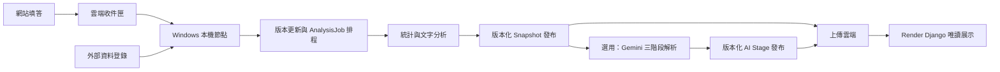

# 回饋洞察 AI 平台

**Feedback Insight Hub**

將顧客回饋轉換為有資料依據、可追溯的營運洞察與改善行動。

回饋洞察 AI 平台整合問卷收集、外部資料匯入、統計分析、文字洞察、Gemini 解析與改善追蹤，協助管理者從回饋中找出問題、查看分析依據，再決定改善措施。

> **第一次看這個專案？** 先讀 [案例說明](docs/case-study.md)（問題、我的角色、設計取捨），再看 [AI 輸出評估](docs/ai-eval.md)（如何讓 LLM 寫的數字可以被信任）。

網站負責問卷、權限、填答與結果展示；Windows 本機節點負責統計、文字分析及經管理者確認的 Gemini 解析。問卷定義與發布結果保存在 Supabase PostgreSQL；節點問卷的回覆經雲端收件匣進入本機節點保存，Render 上的分析頁讀取節點上傳的已發布結果。

## 目前功能

- 登入制問卷建立、題目設定、逐題填答與回覆管理。
- 管理者工作區：營運總覽、營運分析、問卷管理、統計分析、文字洞察、改善追蹤與通知中心。
- 通用外部資料匯入 mapping；外部資料會建立標準的 `Survey`、`Question`、`FeedbackSubmission` 與 `Answer`，和網站填答使用同一條後續分析流程。
- 依題目資料型態產生描述統計、分布與適用的推論分析；目前序位評分的推論分析採秩次檢定或 Spearman 相關，平均數比較限於符合條件的連續型結果。
- 字典式文字分析：關鍵字、分類、情緒與涵蓋率均標示為分析結果，而非原始標籤。
- 本機節點主控台可查看各問卷的資料筆數、最新資料時間、統計／文字版本、Gemini 版本與上傳狀態；統計／文字自動排程，Gemini 由管理者確認後執行。
- 統計／文字結果與 AI 結果分段發布。Gemini 失敗不會覆蓋已成功發布的統計／文字結果。
- 改善建議先是可編輯草稿；建立改善項目、通知與寄信均需明確操作，不會自動執行。

## 資料與分析流程


```mermaid
flowchart LR
    A[網站填答] --> B[雲端收件匣]
    B --> D[Windows 本機節點]
    X[外部資料登錄] --> D
    D --> C[版本更新與 AnalysisJob 排程]
    C --> E[統計與文字分析]
    E --> F[版本化 Snapshot 發布]
    F --> G[選用：Gemini 三階段解析]
    G --> H[版本化 AI Stage 發布]
    F --> U[上傳雲端]
    H --> U
    U --> I[Render Django 唯讀展示]
```

1. 網站回覆經雲端收件匣進入本機節點，外部資料在節點登錄；兩者都寫成標準問卷結構或不可變來源版本。
2. 資料、題目、詞典或分析設定變動時，節點更新版本並合併待處理工作。
3. 節點 Worker 先執行統計與文字分析。
4. 第一階段通過版本核對後，會建立或重用不可變 Snapshot，並發布有限大小的展示 payload。
5. 管理者在節點主控台確認 API 額度後，第二階段才會呼叫 Gemini，依序產生統計解讀、文字洞察與綜合營運解析。
6. 新結果以版本保存；僅在輸入、管線版本與工作租約仍一致時更新發布指標，並由背景同步上傳雲端。Render 只讀雲端套用的結果，不在網頁請求中重算或呼叫 Gemini。

## 元件分工

| 元件 | 責任 |
| --- | --- |
| Django | 網頁、登入與角色權限、問卷、匯入、ORM、版本更新、工作排程、改善追蹤與發布結果讀取 |
| Supabase PostgreSQL | 問卷定義正本、收件匣暫存與收據、節點上傳的發布結果 |
| Windows 本機節點 | 回覆與外部資料正本、統計、文字分析、確認後的 Gemini、版本化發布與上傳 |
| Pandas / SciPy | 描述統計與符合資料型態的推論分析 |
| Gemini | 根據受限、遮蔽且可驗證的分析證據產生解讀與改善草稿；不是統計計算器或最終決策者 |
| Render | Django 網站與靜態資源；分析頁只展示已發布結果 |

## 版本、併發與發布

- `SurveyAnalysisState` 保存每份問卷的輸入／設定版本與目前發布指標。
- `AnalysisJob` 將「統計與文字」及「AI synthesis」分為獨立工作，支援合併、取消、有限重試、租約與心跳。
- 工作完成時會再次核對版本與租約，防止過期 Worker 覆蓋較新的結果。
- Snapshot 保存分析快照，AI Stage 另以 revision 記錄各次執行。發布新結果會更新目前指標並保留舊結果；歷史結果留存不等於已具備完整回測或原始資料修訂重建功能。
- SQLite 適合一般純計算測試；原子領取、租約接手與過期 Worker 發布行為須在隔離 PostgreSQL 驗證。

## 資料保護與使用界線

- 不將 API key、資料庫密碼或 `.env` 提交 Git、寫入 log 或打包至 EXE。
- 外部資料的原始 `user_id` 僅在受控去重流程中使用；不得出現在清理產物、資料庫、UI 或 log。清理後評論仍可能含個資，不能視為完全匿名。
- 正式評論不可由 AI 或人工生成、翻譯、改寫或補造。測試 fixture 不得混入正式分析。
- 傳給 Gemini 的文字證據需經遮蔽，並限制筆數、單筆長度與總長度。AI evidence 與公開輸出也需避免個資。
- 詞典產生的情緒、關鍵字，以及 Gemini 的洞察與改善建議均屬分析結果，須由管理者審閱；詞典涵蓋率不代表準確率，相關性與群組差異不代表因果關係。

## 本機開發

以下以 Windows PowerShell 為例。請在隔離的開發資料庫操作；`migrate` 會修改所選資料庫 schema。

```powershell
python -m venv .venv
.\.venv\Scripts\Activate.ps1
python -m pip install -r requirements.txt
if (-not (Test-Path .env)) { Copy-Item .env.example .env }
```

必要環境變數依部署角色設定：

```env
DJANGO_SECRET_KEY=
DATABASE_URL=
DEBUG=True
ALLOWED_HOSTS=127.0.0.1,localhost

# 僅開發用指令（例如 run_ai_eval）需要；本機節點的金鑰存在 Windows 認證管理員
GOOGLE_API_KEY=
GEMINI_MODEL=gemini-3.6-flash
```

- 未設定 `DATABASE_URL` 時，開發環境可使用 SQLite；需要與網站共用資料時，設定受控的 PostgreSQL／Supabase 連線。
- `GOOGLE_API_KEY` 只用於開發指令；Render 不應設定這個值。
- 請以既有管理流程建立 Manager 帳號；範例或 seed 資料不是標準啟動步驟。

編輯 `.env` 並確認資料庫目標後，再初始化及啟動網站：

```powershell
python manage.py migrate
python manage.py runserver
```

開啟 `http://127.0.0.1:8000/`。本機網站與 Render 使用相同的分析展示流程：頁面只讀已發布結果，統計、文字與 Gemini 由本機節點產生並上傳。

### 在另一台電腦接續開發

Git 只帶走程式與文件；以下三樣只在原本的開發機上，需另外搬移（例如 USB），**不要上傳到公開位置**：

| 項目 | 放置位置 | 備註 |
|---|---|---|
| `.env` | 專案根目錄 | 含資料庫連線與 Gemini 金鑰；與原機共用同一個 Supabase，寫入會影響正式網站 |
| 本機資料包（`data/local/` 的 TripAdvisor clean／manifest／report／分析產物、`ai-eval/`） | 解壓到專案根目錄 | 評論正文仍可能含個資；不含 raw（有 `user_id`） |

```powershell
winget install Python.Python.3.13
git clone https://github.com/arvin85113/feedback-insight-hub-ai.git
cd feedback-insight-hub-ai
py -3.13 -m venv .venv
.\.venv\Scripts\python.exe -m pip install -r requirements-desktop.txt
# 放入 .env 與解壓本機資料包後：
.\.venv\Scripts\python.exe manage.py check
.\.venv\Scripts\python.exe manage.py test feedback accounts config --settings=config.settings_test
```

若沒有資料包，可用 `prepare_local_dataset`（見 [外部資料交接](docs/external-dataset-import.md)）重新下載並驗證 TripAdvisor 資料；
內容雜湊會與原機相同。

## Windows 本機節點與 EXE

本機節點是唯一做分析的地方：系統匣＋網頁主控台 `http://127.0.0.1:8750/`（被占用時往後找埠），並監督分析 Worker。

```powershell
# 從原始碼啟動
.\.venv\Scripts\python.exe -m pip install -r requirements-desktop.txt
.\.venv\Scripts\python.exe -m desktop_app

# 封裝（輸出 dist/FeedbackInsightHubNode/FeedbackInsightHubNode.exe，須保留整個資料夾）
.\scripts\build_desktop.ps1
```

| 啟動方式 | 角色 |
|---|---|
| 不帶參數 | 本機節點（`DEPLOYMENT_MODE=node`） |
| `--worker` | 由節點自動啟動的分析 Worker，不需手動執行 |
| `--smoke-test` | 封裝驗證：只檢查模組與模板，不啟動伺服器、不套用 migration、不呼叫 API |

- 資料都在 `%LOCALAPPDATA%\FeedbackInsightHub\`（`data\node.sqlite3`、`secrets\`、`run\`、`logs\node.log`、`logs\worker.log`）；試跑時可用 `FEEDBACK_HUB_NODE_HOME` 指到隔離資料夾。
- 節點只讀 `NODE_DATABASE_URL`（預設本機 SQLite），不讀 `.env` 的 `DATABASE_URL`，不會直接連 Supabase。正常啟動會套用本機 DB migration；首次啟動開啟一次性設定頁建立擁有者，之後以本機帳號登入（allauth，閒置 4 小時登出）。設計見 [本機節點規格](docs/superpowers/specs/2026-09-30-local-node-console-and-auth-design.md)。
- 封裝不包含 `.env`、憑證、完整 Parquet 或其他大型資料產物；`-Diagnostic` 產生主控台診斷版，只作最後手段。正式安裝包與簽章仍待完成。

**分析與 Gemini**：主控台「分析工作」顯示各問卷的筆數、資料／統計／AI 時間與版本狀態，可排程統計／文字、預覽 Gemini 與取消工作。
OWNER 在「設定 → Gemini」把金鑰存入 Windows 認證管理員；節點不讀 `.env` 的 `GOOGLE_API_KEY`，金鑰不寫 DB 或紀錄。
每次 Gemini 確認綁定輸入、設定、來源、模型、提示與憑證版本，通常三段，含格式重試硬上限六次；逾時或崩潰留下不確定狀態，停下待查核，不自動重呼。

**外部資料（TripAdvisor）**：在主控台「資料集」選擇已驗證的 manifest 與 mapping；節點核對 SHA-256、大小與筆數，經雲端 API 建立外部資料問卷並登錄不可變來源版本，之後自動分析與上傳。
本機路徑只存在節點，不寫入 Supabase；資料包準備見 [外部資料交接](docs/external-dataset-import.md)。

**雲端同步**：在主控台「雲端連線」輸入雲端網址與裝置權杖（雲端以 `manage.py create_node_device --name <名稱>` 產生，只顯示一次）。
背景同步每 5 分鐘同步問卷定義、從收件匣收取回覆並確認收訖、上傳發布結果；本機發布不等於雲端已收到，以「雲端已接收此版本」為準。
雲端須設定 `CLOUD_SYNC_PROTOTYPE_ENABLED=True` 才開放節點 API；`CLOUD_INBOX_ENABLED=True` 後，指派節點的問卷在發布時開啟收件匣。
明文收件匣只限自測資料：`CLOUD_INBOX_SELF_TEST_SURVEYS` 列出允許的問卷 UUID（逗號分隔），不在清單的節點問卷不能發布、填答會被拒絕；
`CLOUD_INBOX_REQUIRE_SELF_TEST` 預設 `True`，接入真實顧客回覆前須完成加密或另行批准，不可直接改成 `False`。

## Render 部署

`render.yaml` 定義單一 Django web service；`build.sh` 安裝依賴、收集靜態檔並套用 migration。部署前請確認目標資料庫、備份與回復方式，因 migration 會改變 schema。

網站（本機與 Render）一律只讀已發布結果：

- 問卷、權限、設定與工作排程維持必要讀寫。
- 營運分析、統計、文字與 AI 展示僅讀已發布 payload。
- 網頁不掃描全量回覆、不訓練模型，也不呼叫 Gemini。

健康檢查：`/healthz/`（不碰資料庫）與 `/healthz/db/`（資料庫往返）。資料庫無法連線時頁面回傳 503 與自動重新整理的提示頁，而非伺服器錯誤。`.github/workflows/keepalive.yml` 每三天呼叫 `/healthz/db/`，避免 Supabase 免費方案因閒置暫停；已暫停的專案仍需在 Supabase 手動恢復。

## 專案結構

```text
accounts/                         帳號、角色、個人資料與通知偏好
config/                           Django 設定、根路由、WSGI／ASGI
desktop_app/                      Windows 本機節點啟動器、Worker 監督與 EXE 入口
feedback/                         問卷、匯入、分析、工作協調、Snapshot 與改善追蹤
  analysis_input.py               共用分析輸入契約
  analysis_adapters.py            Answer／Parquet 輸入轉接
  analysis_jobs.py                版本失效、排程、租約與發布協調
  analysis_worker.py              統計／文字 Worker
  ai_worker.py                    明確授權的 Gemini Worker
  published_analysis.py           網頁唯讀發布結果
  importing/                      通用外部資料匯入
  import_mappings/                資料集欄位 mapping
docs/                             架構、資料匯入與交接文件
static/ templates/                Django 前端資產與樣板
```

## 目前限制

- 已具備本機節點與 one-folder EXE，但正式安裝包、程式碼簽章與收件匣加密尚未完成。
- 真實 Gemini 呼叫仍受 API 額度、網路、模型延遲與供應商行為影響；不確定狀態不會盲目重呼。
- Manager 目前共用可見問卷，多組織／owner 層級資料隔離仍待實作。通知已有預覽入口，完整改善成效比較與歷史分析版本介面仍需另行規劃與驗證。
- 預測模型訓練、固定資料切分與 EXE 的模型管理介面尚未實作。

## 相關文件

- [案例說明](docs/case-study.md)
- [AI 輸出評估](docs/ai-eval.md)
- [系統架構](docs/architecture.md)
- [技術展示](docs/technical-showcase.md)
- [外部資料匯入與本機資料層](docs/external-dataset-import.md)
- [現況與待辦](docs/next-actions.md)
- [除錯筆記](docs/debugging-notes.md)

## 開發原則

- 先以實際程式、migration 與測試證據判斷功能狀態，不把歷史規劃當成已完成。
- 只執行與修改範圍相關的測試；測試前確認為隔離資料庫。
- 外部正式資料、模型產物與機密檔案不提交 Git。
- 發布、付費 AI、寄信與建立改善項目須依執行環境與權限設定處理。
